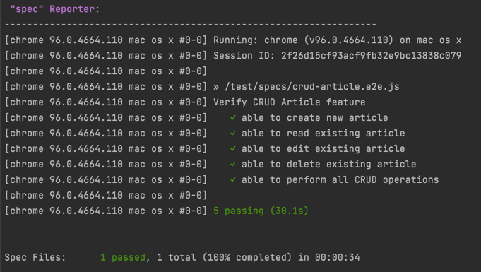

# angular-ui-tests-example

## Preconditions:
- Node installed
- Chrome installed
- Yarn installed

## To run the test please do following:
- `yarn`
- replace `USERNAME` and `PASSWORD` in `.env` file with actual credentials
- replace `BASEURL` with one pointing to the angular application
- `npm run wdio`

> WebDriver.io generator used, I did not change structure or remove commented text, but would do it in normal project.
> Also, linting and pre-commit hooks would be added, but this is well beyond this exercise.

##Test report is generated with `spec` reporter

Test report for manual execution would normally be generated from tools like Jira/x-Ray or TestRail.

| Test Name | Feature | Priority | Result |
|--------|------|-------|-----|
|user is able to create an article      |CRUD Articles |High|Pass|
|user is able to read an article     |CRUD Articles |High|Pass|
|user is able to edit an article      |CRUD Articles |High|Pass|
|user is able to delete an article      |CRUD Articles |Medium|Pass|
|user is able to perform CRUD operations in single flow      |CRUD Articles |High|Pass|

> Basic information for test report is usually includes test name summary, name of bigger feature it is related,
> priority for impact assessment and actual pass/fail result.
